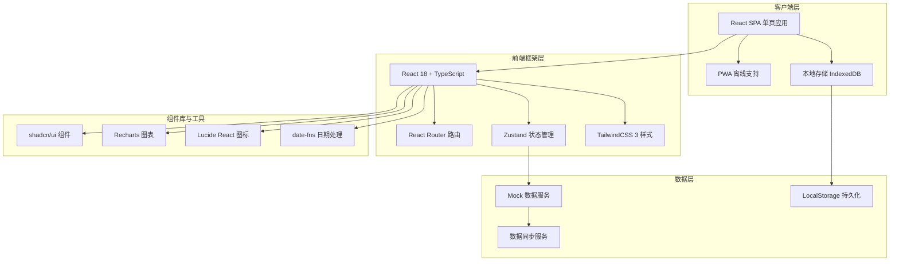
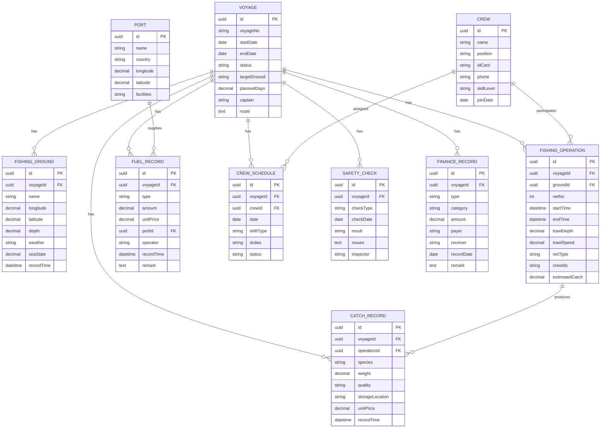

## 1. 架构设计



## 2. 技术描述

- **前端框架**：React 18 + TypeScript + Vite
- **状态管理**：Zustand (轻量级状态管理，支持持久化)
- **路由方案**：React Router v6
- **样式方案**：TailwindCSS 3 + CSS Variables
- **UI组件**：shadcn/ui + 自定义业务组件
- **图表可视化**：Recharts
- **图标库**：Lucide React
- **日期处理**：date-fns
- **表单处理**：React Hook Form + Zod
- **本地存储**：IndexedDB + LocalStorage
- **离线支持**：Service Worker (PWA)
- **构建工具**：Vite 5
- **代码规范**：ESLint + Prettier
- **数据方案**：前端 Mock 数据 + LocalStorage 持久化，无后端依赖

## 3. 路由定义

| 路由路径 | 页面名称 | 功能说明 |
|----------|----------|----------|
| `/` | 总览仪表盘 | 航次进度、今日渔获、油料存量、船员状态、安全预警 |
| `/voyage` | 出海计划 | 航次计划创建、编辑、审批、状态追踪 |
| `/fishing-ground` | 渔场记录 | 渔场坐标管理、渔区信息、海况天气记录 |
| `/fishing-operation` | 捕捞作业 | 网次作业登记、拖网时长、捕捞深度 |
| `/catch` | 渔获登记 | 渔获种类、重量统计、保鲜冷冻舱位分配 |
| `/fuel` | 油料补给 | 油料消耗记录、补给港口管理、成本核算 |
| `/crew` | 船员管理 | 船员信息、排班调度、值更安排 |
| `/safety` | 安全应急 | 海况天气、落水救生预案、安全检查 |
| `/finance` | 收支结算 | 收入统计、支出明细、利润核算、报表导出 |
| `/settings` | 系统设置 | 用户信息、系统配置、数据备份 |

## 4. 数据模型

### 4.1 ER图



### 4.2 前端状态结构

```typescript
// 航次状态
interface VoyageState {
  currentVoyage: Voyage | null;
  voyageList: Voyage[];
  status: 'idle' | 'loading' | 'error';
}

// 捕捞作业状态
interface FishingState {
  operations: FishingOperation[];
  currentOperation: FishingOperation | null;
  grounds: FishingGround[];
  catchRecords: CatchRecord[];
}

// 船员状态
interface CrewState {
  crewList: Crew[];
  schedules: CrewSchedule[];
  currentWatch: CrewSchedule | null;
}

// 油料状态
interface FuelState {
  records: FuelRecord[];
  currentStock: number;
  totalConsumption: number;
}

// 安全状态
interface SafetyState {
  checks: SafetyCheck[];
  weather: WeatherData;
  emergencyPlan: EmergencyPlan;
}

// 财务状态
interface FinanceState {
  records: FinanceRecord[];
  summary: FinanceSummary;
}
```

## 5. 核心模块目录结构

```
src/
├── components/           # 通用组件
│   ├── ui/              # shadcn/ui 组件
│   ├── layout/          # 布局组件
│   ├── charts/          # 图表组件
│   └── business/        # 业务组件
├── pages/               # 页面组件
│   ├── dashboard/       # 总览仪表盘
│   ├── voyage/          # 出海计划
│   ├── fishing-ground/  # 渔场记录
│   ├── operation/       # 捕捞作业
│   ├── catch/           # 渔获登记
│   ├── fuel/            # 油料补给
│   ├── crew/            # 船员管理
│   ├── safety/          # 安全应急
│   └── finance/         # 收支结算
├── store/               # Zustand 状态管理
│   ├── useVoyageStore.ts
│   ├── useFishingStore.ts
│   ├── useCrewStore.ts
│   ├── useFuelStore.ts
│   ├── useSafetyStore.ts
│   └── useFinanceStore.ts
├── types/               # TypeScript 类型定义
│   └── index.ts
├── data/                # Mock 数据
│   ├── mockVoyage.ts
│   ├── mockCrew.ts
│   ├── mockFishing.ts
│   └── mockFinance.ts
├── utils/               # 工具函数
│   ├── format.ts
│   ├── coordinate.ts
│   └── storage.ts
├── hooks/               # 自定义 Hooks
│   ├── useWatchTimer.ts
│   ├── useOfflineSync.ts
│   └── useWeather.ts
├── App.tsx
├── main.tsx
└── index.css
```

## 6. 关键技术实现要点

### 6.1 离线数据持久化
- 使用 `localforage` 封装 IndexedDB 进行离线数据存储
- Zustand 集成 `persist` 中间件实现状态自动持久化
- 实现数据变更队列，网络恢复时自动同步

### 6.2 图表可视化
- 使用 Recharts 实现渔获趋势图、油料消耗图、收支分析图
- 自定义海洋主题配色，深色模式适配

### 6.3 表单验证
- React Hook Form 处理表单状态
- Zod 定义数据验证 schema
- 实时验证反馈，错误信息本地化显示

### 6.4 响应式布局
- TailwindCSS 断点：sm(640px)、md(768px)、lg(1024px)、xl(1280px)
- Grid + Flex 混合布局，桌面侧边栏、移动端底部导航
- CSS Container Queries 实现组件级响应式

### 6.5 性能优化
- React 18 并发特性，Suspense 边界处理
- 路由懒加载，代码分割
- 虚拟滚动处理大量数据表格
- 图表数据防抖更新
